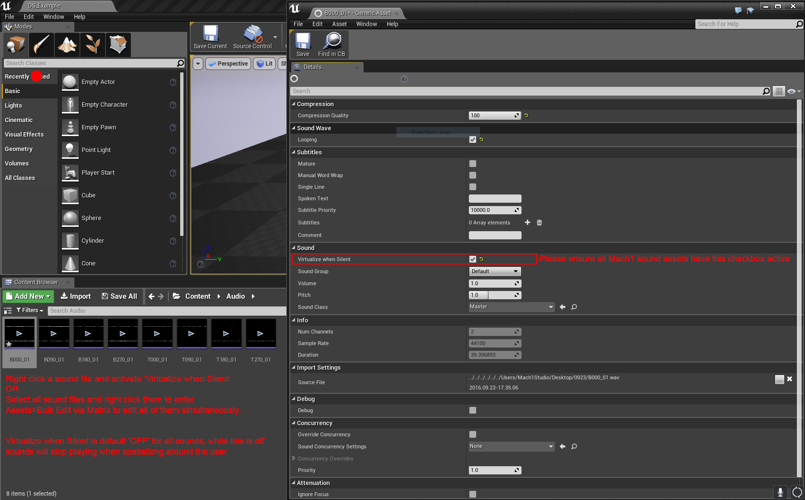

# Mach1 Spatial Decode Plugin [Unreal Engine]

## Instructions:

1. Create or convert to a cpp project (reference: [http://allarsblog.com/2015/11/05/Converting-BP-Project-To-CPP/](http://allarsblog.com/2015/11/05/Converting-BP-Project-To-CPP/))
2. Copy the [Mach1DecodePlugin](Mach1DecodePlugin) directory to your project's `Plugins` directory at the root of your project.
3. Check that plugin activated . go to menu "edit" -> "plugins" -> "audio" -> "Mach1 Decode Plugin"
4. In class/objects browser find "Mach1Spatial Actor" and add to scene

### Unreal Engine 4+ Setup Notes
- Set Project setting to play sound with volume = 0 (Virtualize Silent Sounds)

### Unreal Engine 5 Setup Notes
- Apply the following settings to all audio files used in the M1SpatialActor object
- Change the `Virtualization Mode` to `Play when Silent`
- Check the `Priority` `Bypass Volume Scale for Priority` to true

## QA:

QA to final Packaging of project completed on:
4.17, 4.18, 4.19, 4.22, 4.24, 5.0, 5.1, 5.2

### CONTACT:
Mach1:  
whatsup@mach1.tech
